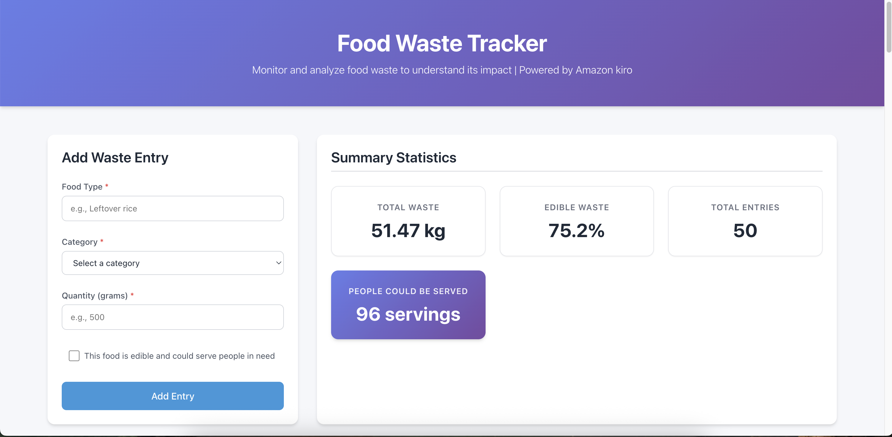
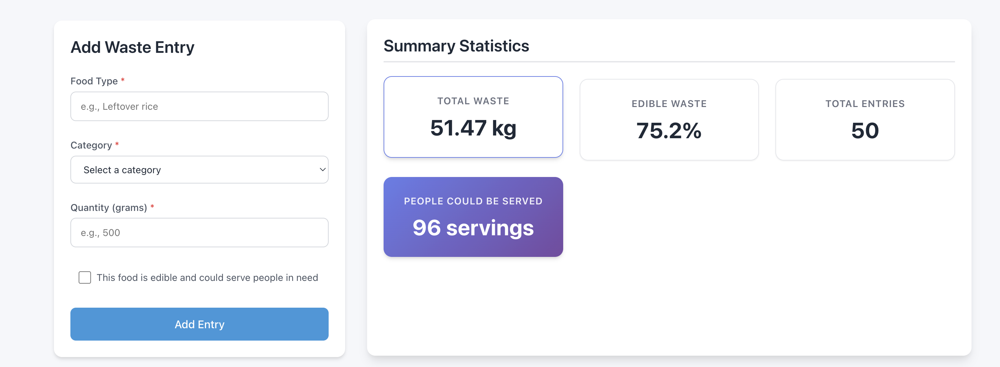
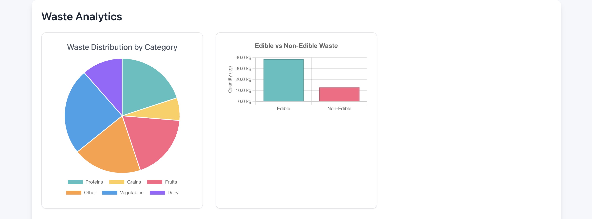
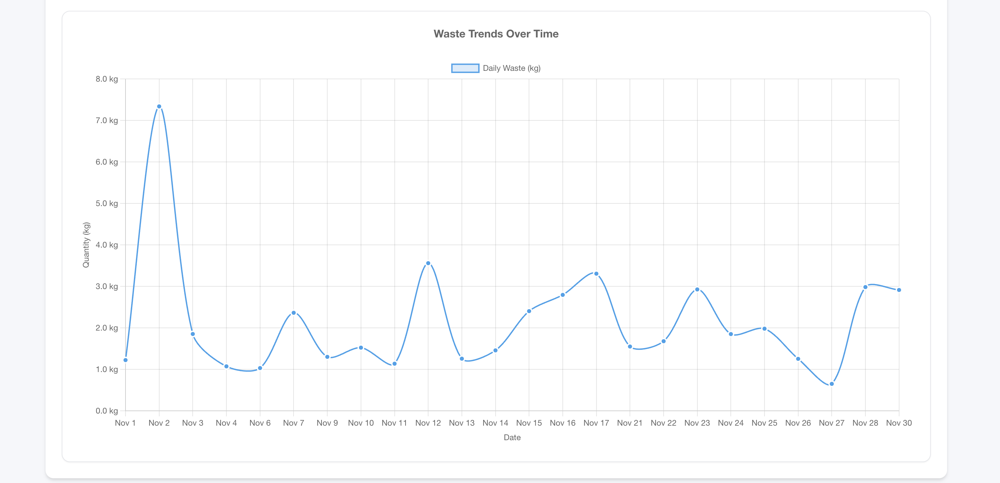
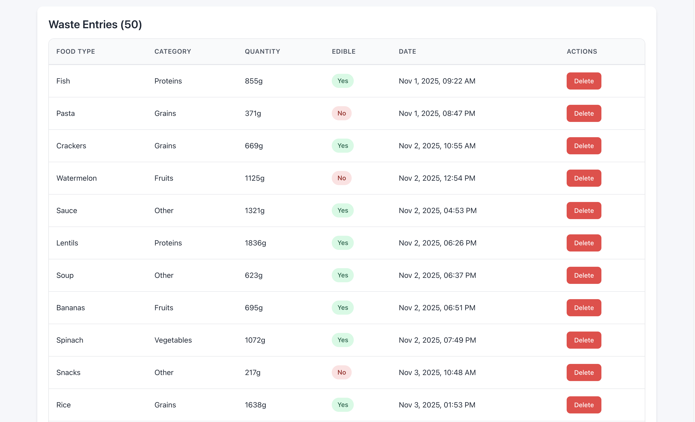

# 🗑️ Food Waste Tracker

A modern, responsive web application for monitoring and analyzing food waste data. Track wasted food quantities, understand waste patterns, and calculate how much edible waste could serve people in need.


## ✨ Features

- **📝 Easy Entry Management**: Add food waste entries with type, category, quantity, and edibility status
- **📊 Interactive Visualizations**: 
  - Pie chart showing waste distribution by category
  - Bar chart comparing edible vs non-edible waste
  - Line chart displaying waste trends over time
- **📈 Real-time Statistics**: 
  - Total waste in kilograms
  - Edible waste percentage
  - Number of servings that could feed people in need
  - Total entry count
- **💾 Local Data Persistence**: All data saved to browser localStorage
- **🎨 Clean, Intuitive Interface**: Responsive design that works on desktop and mobile
- **♿ Accessibility First**: WCAG AA compliant with keyboard navigation support
- **🧪 Comprehensive Testing**: Unit tests and property-based tests with Vitest

## 🖼️ Screenshots

### Dashboard Overview

*Main dashboard showing statistics, charts, and entry form*

### Entry Form

*Add new food waste entries with validation*

### Statistics Panel

*Real-time statistics showing total waste, edible percentage, and servings*

### Interactive Charts

*Pie chart, bar chart, and line chart for data visualization*

### Waste Entry List

*View and manage all waste entries with delete functionality*

### Mobile Responsive

*Fully responsive design for mobile devices*

## 🚀 Getting Started

### Prerequisites

- Node.js 18+ and npm
- Modern web browser (Chrome, Firefox, Safari, or Edge)

### Installation

1. Clone the repository:
```bash
git clone https://github.com/gotoark/food-waste-tracker.git
cd food-waste-tracker
```

2. Install dependencies:
```bash
npm install
```

3. Start the development server:
```bash
npm run dev
```

4. Open your browser and navigate to `http://localhost:5173`

### Building for Production

```bash
npm run build
```

The optimized production build will be in the `dist` folder.

### Running Tests

```bash
npm test
```

Run tests in watch mode:
```bash
npm run test:watch
```

## 🎯 Usage

### Adding Waste Entries

1. Fill in the food type (e.g., "Leftover rice")
2. Select a category (Fruits, Vegetables, Grains, Proteins, Dairy, Other)
3. Enter quantity in grams (1-99,999)
4. Check "Edible" if the food could serve people in need
5. Click "Add Waste Entry"

### Viewing Statistics

The statistics panel automatically updates to show:
- **Total Waste**: Sum of all waste in kilograms
- **Edible Percentage**: Percentage of waste that's edible
- **Servings**: Number of people that could be served (400g per serving)
- **Total Entries**: Count of all waste records

### Analyzing Trends

Use the interactive charts to:
- See waste distribution across food categories
- Compare edible vs non-edible waste quantities
- Track waste patterns over time

### Managing Entries

- View all entries in the list at the bottom
- Click the delete button to remove an entry
- Confirm deletion in the dialog

### Seeding Sample Data

For testing and demonstration, visit `http://localhost:5173/seed.html` to add random sample data.

## 🏗️ Architecture

### Technology Stack

- **Frontend**: React 18 with TypeScript
- **Build Tool**: Vite 7
- **Charts**: Chart.js with react-chartjs-2
- **Testing**: Vitest with React Testing Library
- **Styling**: CSS Modules with CSS Variables
- **State Management**: React Context API
- **Data Persistence**: Browser localStorage

### Project Structure

```
src/
├── components/          # React components
│   ├── Dashboard.tsx    # Main container
│   ├── WasteEntryForm.tsx
│   ├── StatisticsPanel.tsx
│   ├── ChartSection.tsx
│   ├── PieChart.tsx
│   ├── BarChart.tsx
│   ├── LineChart.tsx
│   └── WasteEntryList.tsx
├── context/            # Global state management
│   └── WasteContext.tsx
├── services/           # Business logic
│   ├── storageService.ts
│   └── calculationService.ts
├── types/              # TypeScript definitions
│   └── index.ts
├── utils/              # Utility functions
│   └── seedData.ts
└── test/               # Test setup
    └── setup.ts
```

## 🧪 Testing

The application includes comprehensive test coverage:

- **Unit Tests**: Component behavior, form validation, data transformations
- **Property-Based Tests**: Universal properties using fast-check
- **Integration Tests**: Complete user flows

Test files are co-located with source files using `.test.tsx` suffix.

## 📝 Design Specifications

This project was built following a formal specification-driven development process:

- **Requirements Document**: User stories and acceptance criteria
- **Design Document**: Architecture, components, and correctness properties
- **Implementation Plan**: Task breakdown and testing strategy

See `.kiro/specs/food-waste-tracker/` for detailed specifications.

## 🤝 Contributing

Contributions are welcome! Please feel free to submit a Pull Request.

1. Fork the repository
2. Create your feature branch (`git checkout -b feature/AmazingFeature`)
3. Commit your changes (`git commit -m 'Add some AmazingFeature'`)
4. Push to the branch (`git push origin feature/AmazingFeature`)
5. Open a Pull Request

## 📄 License

This project is licensed under the MIT License - see the LICENSE file for details.

## 🙏 Acknowledgments

- Developed with love 😊 in **AI for Bharat**
- Powered by **Amazon Kiro** ✨
- Built with modern web technologies and best practices
- Inspired by the need to reduce food waste and help those in need

## 📧 Contact

**gotoark** - gotoark@gmail.com

Project Link: [https://github.com/gotoark/food-waste-tracker](https://github.com/gotoark/food-waste-tracker)

---

**Made with ❤️ to help reduce food waste and make a difference**
